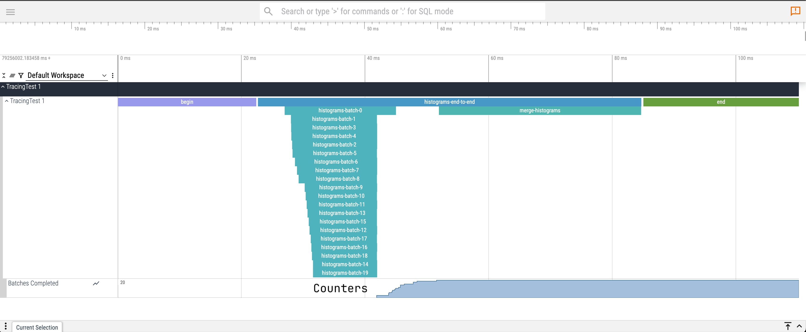

## Tracing Driver

An experimental tracing backend that supports extremely low overhead tracing for JVM and Android
apps; with the goal of supporting more platforms supported by the Kotlin Multiplatform ecosystem.

The traces are captured using standard trace format defined by
[Perfetto](https://perfetto.dev/docs/reference/trace-packet-proto). All tools that consume
perfetto traces can continue being used. [ui.perfetto.dev](https://ui.perfetto.dev) can be used
to visualize traces. Tools like
[TraceProcessor](https://perfetto.dev/docs/analysis/trace-processor-python) can be used for
analysing traces.

## Usage

To start recording traces, you need to create an instance of a
[`TraceDriver`](src/commonMain/kotlin/androidx/tracing/driver/TraceDriver.kt).

```kotlin
val driver = TraceDriver(
    // A unique sequence id identifying the program emitting traces.
    sequenceId = 1,
    // The trace sink. Determines where traces are stored.
    // The library provides an implementation to a tracing sink out of the box.
    // You can also write your own implementation of a TraceSink.
    sink = JvmTraceSink(File("/path/to/trace/directory")),
    // If injecting an instance of Driver, setting this to `false` means that no traces will be
    // emitted to the sink. You don't have to change all the call sites where traces are captured.
    isEnabled = true
)
```

The `TraceDriver` provides a `context` which is of type
[`TraceContext`](src/commonMain/kotlin/androidx/tracing/driver/TraceContext.kt).

### Trace Context

The `TraceContext` provides a way to create process and thread tracks. For more context on what
tracks are, please refer
to [the documentation](https://perfetto.dev/docs/instrumentation/track-events#tracks).

### Process Tracks

To create a [ProcessTrack](src/commonMain/kotlin/androidx/tracing/driver/ProcessTrack.kt) you can
use the following API:

```kotlin
// driver.ProcessTrack(...) is an alias for driver.context.ProcessTrack(...)
val process = driver.context.ProcessTrack(
    // The process id
    id = 1,
    // The name of the process
    name = "processName"
)
```

### Thread Tracks

To create a [ThreadTrack](src/commonMain/kotlin/androidx/tracing/driver/ThreadTrack.kt), you can
use a `ProcessTrack` instance :

```kotlin
val threadTrack = process.ThreadTrack(
    // The thread id
    id = 10,
    // The name of the thread
    name = "threadName"
)
```

### Tracing

Once you have a track that you want to attach traces to, you can do:

#### Basic

```kotlin
track.trace("traceSectionName") {
    // The code that is being instrumented
    doSomethingExpensive()
}
```

#### Context Propagation

The library also provides an implementation for tracing APIs that make use of Kotlin Coroutines
to propagate the tracing context across multiple coroutines.

```kotlin
track.traceFlow("traceSectionName") {
    // suspend block
    // propagates flowId to inner coroutines automatically to do context propagation.
}
```

For e.g.

```kotlin
suspend fun ProcessTrack.forkJoin(input: List<Int>) {
    coroutineScope {
        val batches = input.chunked(CHUNK_SIZE)
        val jobs = mutableListOf<Deferred<List<Int>>()
        batches.forEachIndexed { index, batch ->
            jobs += async {
                traceFlow("batch-$index") { fork(batch) }
            }
        }
        val results = jobs.awaitAll()
        return traceFlow("merge") {
            merge(results)
        }
    }
}
```


#### Counters

You can also create tracks that emit counters as metrics. To create a counter you can use:

```kotlin
// The name of the counter.
val counter = process.CounterTrack("MemoryUsage")
```

To emit metrics you can:

```kotlin
counter.emitLongCounterPacket(longValue)
// Or
counter.emitDoubleCounterPacket(doubleValue)
```



For an end to end tracing example app, look at
[`TracingDemoTest.kt`](src/jvmTest/kotlin/androidx/tracing/driver/TracingDemoTest.kt).

### Flushing Traces

Traces are flushed to the sink asynchronously. To force a flush, you can always call `context.flush()`.

Prior to termination of the program, call `traceContext.close()` to finalize all traces to the sink.
(A [TraceContext](src/commonMain/kotlin/androidx/tracing/driver/TraceContext.kt) is a `Closeable`).
